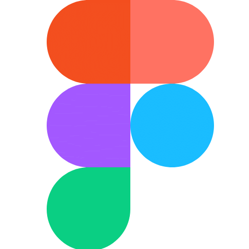

  

  <h1>Jboy</h1>
  
<strong>AI × Mobile Developer</strong>

  
Building the next generation of mobile apps powered by AI.

  
AI とモバイルをつなぎ、次のアプリ体験をつくる。

  
<strong>iOS / Android / LLM Integration</strong>

  
<a href="https://x.com/JBOY83062526">X · @JBOY83062526</a>

---

## About

AI-native Mobile Developer 🤖📱

iOS / Android と LLM Integration を軸にした、技術スタックのポートフォリオです。

## Tech Stack

### Mobile Development

iOS / Android・モバイルアプリ開発

<table>
  <tr>
    <td align="center" width="140"> iOS / Apple</td>
    <td align="center" width="140"> Android</td>
    <td align="center" width="140"> Swift</td>
    <td align="center" width="140"> Kotlin</td>
  </tr>
  <tr>
    <td align="center" width="140"> Dart</td>
  </tr>
</table>

### Frontend

Web UI・フロントエンド

<table>
  <tr>
    <td align="center" width="140"> TypeScript</td>
    <td align="center" width="140"> React</td>
    <td align="center" width="140"> Vite</td>
    <td align="center" width="140"> Tailwind CSS</td>
  </tr>
</table>

### Backend & API

バックエンド・API 開発

<table>
  <tr>
    <td align="center" width="140"> Python</td>
    <td align="center" width="140"> FastAPI</td>
    <td align="center" width="140"> Node.js</td>
    <td align="center" width="140"> NestJS</td>
  </tr>
  <tr>
    <td align="center" width="140"> Swagger</td>
  </tr>
</table>

### Database

データベース

<table>
  <tr>
    <td align="center" width="140"> PostgreSQL</td>
    <td align="center" width="140"> MySQL</td>
    <td align="center" width="140"> SQLite</td>
  </tr>
</table>

### Cloud & Delivery

クラウド・CI/CD・ビルド

<table>
  <tr>
    <td align="center" width="140"> Google Cloud</td>
    <td align="center" width="140"> Cloudflare</td>
    <td align="center" width="140"> GitHub Actions</td>
    <td align="center" width="140"> Gradle</td>
  </tr>
</table>

### Development Tools

バージョン管理・テスト・デザイン・タスク管理

<table>
  <tr>
    <td align="center" width="140"> GitHub</td>
    <td align="center" width="140"> GitLab</td>
    <td align="center" width="140"> pytest</td>
    <td align="center" width="140"> Figma</td>
  </tr>
  <tr>
    <td align="center" width="140"> Trello</td>
  </tr>
</table>

### IDE & Editors

開発環境

<table>
  <tr>
    <td align="center" width="140"> Xcode</td>
    <td align="center" width="140"> Android Studio</td>
    <td align="center" width="140"> VS Code</td>
  </tr>
</table>

### AI & LLM

LLM・AI コーディングツール

<table>
  <tr>
    <td align="center" width="140"> OpenAI</td>
    <td align="center" width="140"> Claude</td>
    <td align="center" width="140"> Gemini</td>
    <td align="center" width="140"> Codex</td>
  </tr>
  <tr>
    <td align="center" width="140"> Claude Code</td>
    <td align="center" width="140"> GitHub Copilot</td>
    <td align="center" width="140"> Cursor</td>
    <td align="center" width="140"> Devin</td>
  </tr>
</table>

---

<strong>Jboy · AI × Mobile Developer</strong> <a href="https://x.com/JBOY83062526">@JBOY83062526</a>

